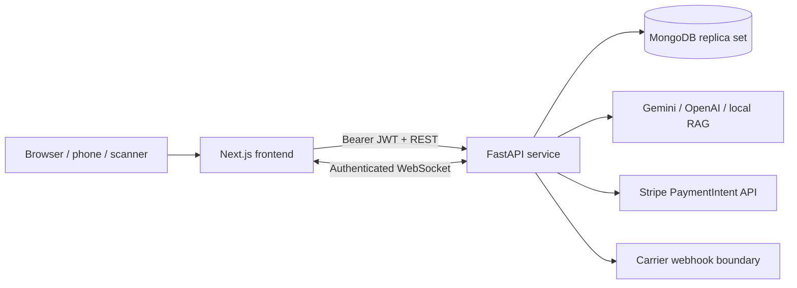

# Whitfield WMS

[](https://github.com/Pawanp-23/Warehouse-Management-System/actions/workflows/backend-ci.yml)
[](https://github.com/Pawanp-23/Warehouse-Management-System/actions/workflows/frontend-ci.yml)

Whitfield is a multi-tenant warehouse-management platform for 3PL operators. It connects authenticated warehouse workflows, transactional inventory, shipment tracking, billing, realtime events, barcode-ready identifiers, and a document-grounded AI copilot in one application.

> This repository is a production-oriented reference implementation, not a finished certified WMS. Real payments, carrier updates, email delivery, and production identity require provider credentials and signed webhooks.

## Capabilities

- Multi-tenant seller, warehouse, location, and product master data
- UUID-based automation directory and human-readable autofill controls
- Inbound receiving with good/damaged stock conditions
- Atomic inventory reservations and overselling prevention
- Orders, shipments, carrier IDs, tracking events, and delivery states
- Invoice generation and Stripe PaymentIntent integration boundary
- JWT authentication and `user`, `staff`, `manager`, and `admin` roles
- Tenant-scoped REST APIs and authenticated WebSocket updates
- PDF knowledge ingestion, grounded chat, Gemini/OpenAI adapters, and local fallback
- Responsive Next.js operations dashboard and motion-led landing experience

## Architecture



MongoDB runs as a replica set because inventory commands use multi-document transactions. The API is authoritative: the frontend displays human-readable names but submits stable UUIDs.

## Technology

| Layer | Stack |
|---|---|
| Frontend | Next.js 16, React 19, TypeScript |
| Backend | FastAPI, Pydantic, PyMongo |
| Database | MongoDB 8 replica set |
| Realtime | Authenticated WebSockets |
| AI | Gemini, OpenAI, extractive local fallback |
| Payments | Stripe PaymentIntents |
| Delivery | Docker Compose, GitHub Actions |

## Quick start with Docker

Requirements: Docker Desktop with Compose v2.

```bash
git clone https://github.com/Pawanp-23/Warehouse-Management-System.git
cd Warehouse-Management-System
docker compose -f infra/docker-compose.yml up --build
```

Open:

- Frontend: <http://localhost:3000>
- OpenAPI documentation: <http://localhost:8000/docs>
- API health: <http://localhost:8000/api/v1/health>

The Compose configuration uses development-only credentials. Do not deploy those values.

## Local development

Copy the templates before starting either application:

```bash
cp .env.example .env
cp frontend/.env.local.example frontend/.env.local
```

Start MongoDB and the API:

```bash
docker compose -f infra/docker-compose.yml up -d mongo
cd backend
python -m venv .venv
# Windows: .venv\Scripts\activate
# macOS/Linux: source .venv/bin/activate
pip install -r requirements.txt
uvicorn main:app --reload --port 8000
```

Start the frontend in a second terminal:

```bash
cd frontend
corepack enable
pnpm install --frozen-lockfile
pnpm dev --port 3000
```

## Environment configuration

The committed [`.env.example`](./.env.example) documents backend variables. Important production settings include:

- `AUTH_REQUIRED=true`
- A unique `JWT_SECRET` of at least 32 bytes
- Explicit `CORS_ORIGINS` and `TRUSTED_HOSTS`
- `DOCS_ENABLED=false`
- Provider secrets stored in a secret manager, never Git

AI keys are optional. Without them, the assistant uses the local extractive-RAG fallback. Without `STRIPE_SECRET_KEY`, payment creation returns `GATEWAY_NOT_CONFIGURED`; it never fakes a successful payment.

## Roles

| Role | Access |
|---|---|
| User | Tenant-scoped read access |
| Staff | Tenant-scoped operational visibility |
| Manager | Warehouse operations, setup, shipping, invoices, and payments |
| Admin | Manager capabilities plus user and role administration |

Financial, shipment, and inventory history is intentionally auditable. Production workflows should void, reverse, cancel, or archive records instead of hard-deleting them.

## Core workflow

1. Register the first organization administrator.
2. Create seller, warehouse, bin, and product master data.
3. Open and complete a receipt to move inventory from `RECEIVING` to `AVAILABLE`.
4. Create an order to atomically move stock from `AVAILABLE` to `RESERVED`.
5. Create a carrier shipment and append tracking lifecycle events.
6. Create an invoice and, when configured, a Stripe PaymentIntent.

## Verification

Backend:

```bash
cd backend
pytest -q
```

Frontend:

```bash
cd frontend
pnpm lint
pnpm build
```

GitHub Actions runs both verification paths on pushes and pull requests.

## Documentation

- [API contract](./docs/api-contract.md)
- [Database design](./docs/database-design.md)
- [Original case study](./Case-Study-Whitfield-Fulfillment.pdf)
- Interactive OpenAPI documentation at `/docs` when enabled

## Security

Review [SECURITY.md](./SECURITY.md) before deployment or vulnerability reporting. For a real multi-instance service, use a managed rate limiter and replace the shared HS256 secret with an external OIDC provider and asymmetric JWKS validation.

## Project status

The repository currently provides an end-to-end WMS demonstration and a stable base for further work. Outstanding production integrations include signed Stripe settlement webhooks, carrier-specific webhook adapters, refresh-token rotation, MFA/SSO, object storage, outbound email, observability, backups, and deployment infrastructure.
